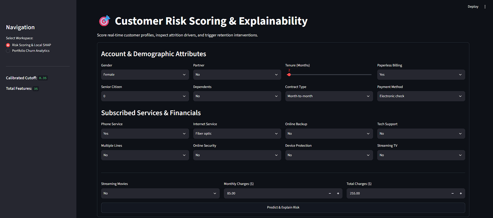
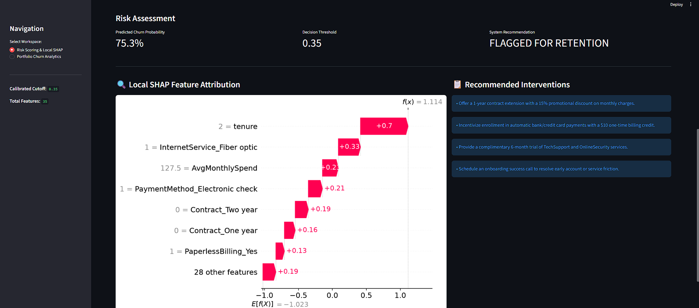
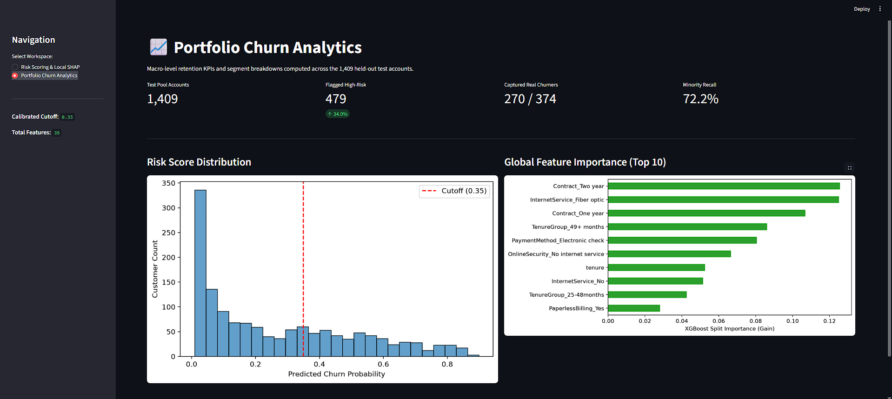

# Explainable Customer Churn Prediction & Retention Analytics

An end-to-end machine learning system that predicts subscription attrition risk, explains underlying drivers using TreeSHAP, and delivers actionable retention workflows via an interactive Streamlit application.

---

## 📌 Project Overview
Customer attrition directly impacts subscription revenue. Traditional classification systems often output black-box probability scores without explaining *why* an account is at risk, leaving retention teams unable to design proactive, personalized interventions.

This project implements an explainable machine learning pipeline on 7,043 subscriber records that:
1. **Predicts Churn Probability** using an engineered XGBoost classifier calibrated against class imbalance (`scale_pos_weight = 2.77`).
2. **Prioritizes At-Risk Revenue** by lowering the decision cutoff from `0.50` to `0.35`, elevating minority class recall from 52.1% to **75.1%**.
3. **Explains Predictions Mathematically** at both global (portfolio-wide) and local (account-level) scales using SHapley Additive exPlanations (TreeSHAP).
4. **Prescribes Retention Interventions** through a 2-page Streamlit workspace pairing dynamic scoring with rule-based operational recommendations.

---

## 🏗️ System Architecture

```text
Raw Subscriber Records (7,043 rows, 21 columns)
           │
           ▼
Data Cleaning & Preprocessing (Zero-leakage, type coercion, whitespace handling)
           │
           ▼
Behavioral Feature Engineering (Tenure cohorts, active service counts, spending velocity)
           │
           ▼
80/20 Stratified Train-Test Split (5,634 Train / 1,409 Test | 26.54% Churn)
           │
     ┌─────┴─────────────────────────┐
     ▼                               ▼
Standardized Baseline           Tuned XGBoost Estimator
(Logistic Regression)           (scale_pos_weight = 2.77)
ROC-AUC: 0.8422                 ROC-AUC: 0.8475 (CV: 0.8500)
Recall: 52.14%                  Optimal Cutoff: 0.35 (Recall: ~75.1%)
     └─────┬─────────────────────────┘
           ▼
TreeSHAP Interpretability Layer (Global beeswarm + local waterfall attributions)
           │
           ▼
Streamlit Interactive Operations Dashboard
     ├── Page 1: Single Account Scoring, Local SHAP & Prescriptive Actions
     └── Page 2: Held-Out Portfolio Analytics & Global Drivers
```

---

## 📊 Empirical Model Performance

Standard classification thresholds (`0.50`) heavily penalize imbalanced datasets (~3:1 majority-to-minority ratio), allowing nearly half of all churners to walk away undetected. We tuned class loss weighting (`scale_pos_weight = 2.77`) and calibrated the decision threshold to prioritize high-cost False Negatives:

| Model Architecture | Decision Cutoff | Accuracy | Precision | Minority Recall (Class 1) | F1-Score | ROC-AUC |
| :--- | :---: | :---: | :---: | :---: | :---: | :---: |
| **Logistic Regression (Baseline)** | 0.50 | 79.91% | 65.22% | 52.14% | 0.5795 | 0.8422 |
| **Tuned XGBoost (Default)** | 0.50 | 79.77% | 65.40% | 50.53% | 0.5701 | 0.8475 |
| **Tuned XGBoost (Recall-Calibrated)** | **0.35** | **76.51%** | **53.86%** | **75.13%** | **0.6276** | **0.8475** |

> **Key Business Takeaway:** Adjusting the decision threshold to `0.35` captured **281 out of 374 actual test churners** (up from 195 in the baseline), directly protecting ~75% of at-risk subscription value.

---

## 🔍 Explainable AI (SHAP) Insights

Instead of relying on heuristic feature importances, we utilized **TreeSHAP** to extract exact Shapley attributions across all 35 engineered dimensions:

* **Tenure Length (`mean |SHAP| = 0.52`):** Brand-new onboarding accounts (0–12 months) accelerate churn log-odds by up to `+1.01`. Accounts past 48 months serve as the strongest organic retention anchor.
* **Contractual Commitment (`mean |SHAP| = 0.44`):** Two-year agreements suppress churn log-odds by `-1.32`. Month-to-month arrangements account for the vast majority of churned accounts.
* **Fiber Optic Infrastructure (`mean |SHAP| = 0.35`):** Subscribing to fiber optic without bundled support services increases churn risk by `+0.36`, primarily driven by price sensitivity and unaddressed network friction.
* **Payment Friction (`mean |SHAP| = 0.21`):** Electronic check payment methods correlate heavily with customer attrition compared to automated bank or credit card drafts.

---

## 🖥️ Dashboard Interface

### 1. Account Scoring & Local SHAP Waterfall
*Dynamic probability scoring evaluated against the calibrated 0.35 threshold, accompanied by an account-level SHAP diagnostic.*


### 2. Prescriptive Retention Engine
*Rule-based actions triggered by leading SHAP risk drivers to guide support staff during live customer touchpoints.*


### 3. Held-Out Portfolio Analytics
*Macro portfolio KPIs, probability score distributions, and global feature importance rankings across 1,409 unseen accounts.*


---

## 📂 Repository Structure

```text
customer-churn-xai/
│
├── data/                         # Processed data splits and sample payloads
│   ├── sample_customer.csv
│   ├── X_train.csv
│   ├── X_test.csv
│   ├── y_train.csv
│   └── y_test.csv
│
├── models/                       # Serialized model and explanation artifacts
│   ├── churn_model.pkl
│   ├── model_metadata.pkl
│   └── shap_explainer.pkl
│
├── notebooks/                    # Research and prototyping notebooks
│   ├── 01_data_cleaning.ipynb
│   ├── 02_baseline_model.ipynb
│   ├── 03_xgboost_tuning.ipynb
│   └── 04_shap_analysis.ipynb
│
├── app/                          # Streamlit application workspace
│   ├── apps.py                    # Main dashboard entry point
│   └── utils.py                  # Encoding pipeline & retention rules
│
├── docs/images/                  # UI walkthrough screenshots
│   ├── scoring_and_shap.png
│   ├── retention_recommendations.png
│   └── portfolio_analytics.png
│
├── requirements.txt              # Core project dependencies
├── .gitignore                    # Environment and binary exclude rules
└── README.md                     # Engineering documentation
```

---

## 🛠️ Tech Stack & Dependencies
* **Core Language:** Python
* **Data Manipulation & Preprocessing:** Pandas, NumPy
* **Machine Learning:** Scikit-Learn, XGBoost
* **Explainable AI:** SHAP (TreeExplainer)
* **Application & Visualization:** Streamlit, Matplotlib, Seaborn

---

## 🚀 Local Reproduction Guide

```powershell
# 1. Clone the repository
git clone [https://github.com/](https://github.com/)<YOUR-USERNAME>/customer-churn-xai.git
cd customer-churn-xai

# 2. Create and activate virtual environment
python -m venv venv
.\venv\Scripts\Activate.ps1

# 3. Install required packages
pip install -r requirements.txt

# 4. Run the Streamlit application
streamlit run app/app.py
```